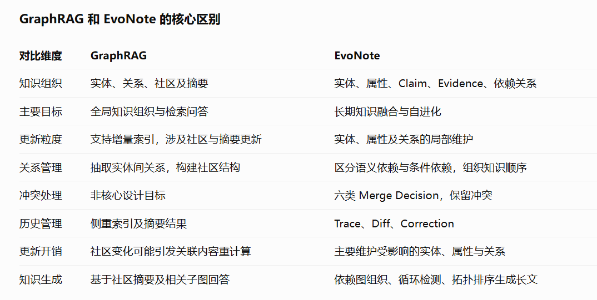
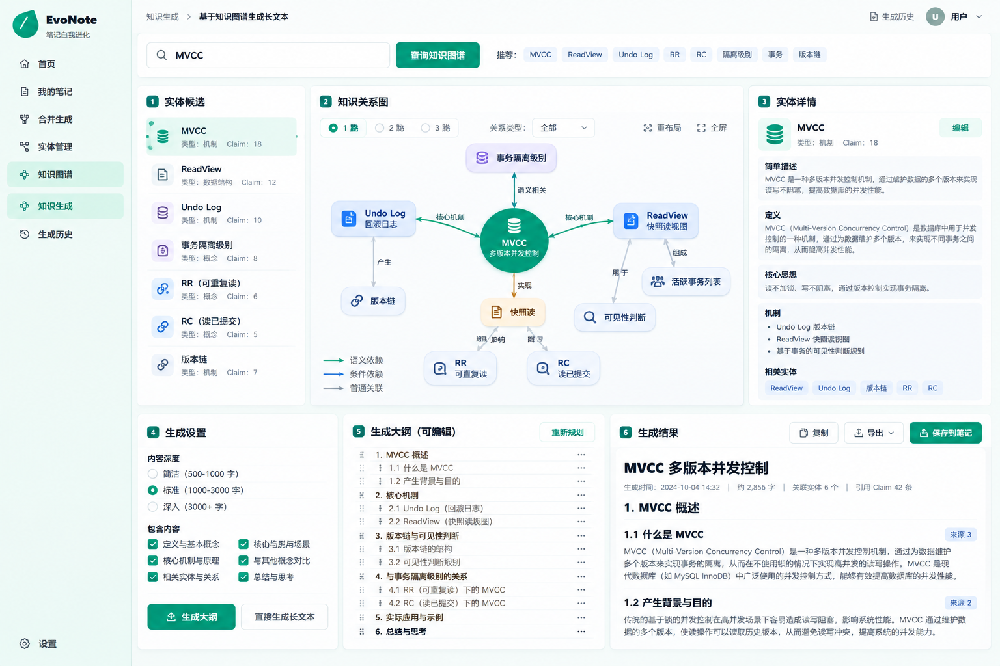
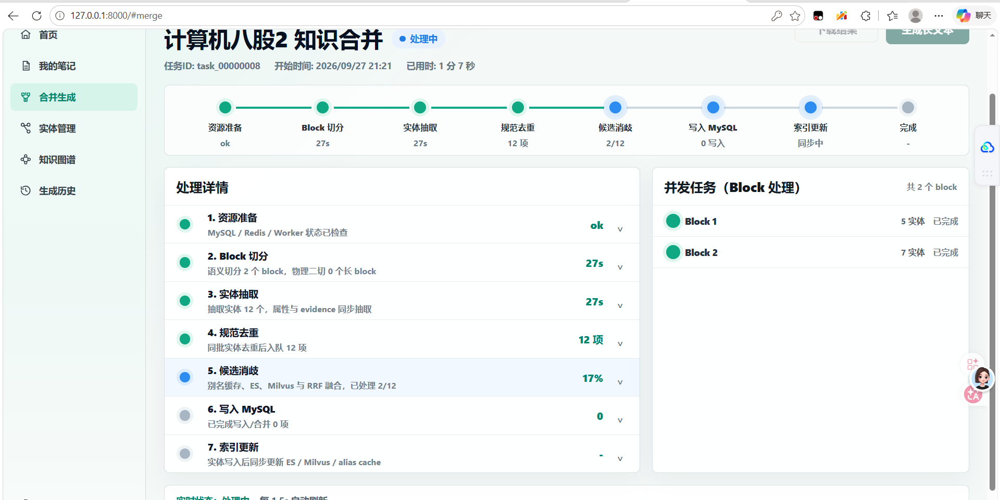

# EvoNote｜基于实体记忆与知识图谱的自进化知识管理系统

**技术栈：** Python、FastAPI、MySQL、Redis、Elasticsearch、Milvus、LLM、Asyncio

**项目背景：** 针对飞书笔记、腾讯 ima 等知识管理产品侧重内容存储与检索问答、跨文档细粒度知识融合和持续治理仍需用户参与的问题，以及传统 GraphRAG 社区摘要与图索引维护存在较高更新开销的局限，设计以**实体-属性-证据为最小维护单元**的自进化记忆系统，实现知识精确分离、历史经验复用、增量融合及依赖图驱动的结构化长文本生成。

**项目亮点与细节：**

- **知识精确分离：** 针对固定长度切块破坏实体语义边界、章节标题和流程步骤易被误识别为独立实体的问题，设计**实体锚点语义切块与双阶段准入机制**。首先通过可定义性、查询价值等 **5 维指标**进行实体初筛（阈值 0.7），再由独立 LLM Judge 结合**身份边界、知识承载、查询价值、演进稳定性 4 项正向指标及 6 项反向惩罚指标**复核；通过原文覆盖校验、确定性二次切分与异常降级，完成实体、属性及 Evidence 的结构化分离。
- **记忆引导检索：** 针对传统 Hybrid Retrieval 反复执行 Embedding、向量召回及 LLM 消歧造成的资源浪费，设计 **Memory-Guarded Hybrid Retrieval**，优先通过 Redis 关系缓存与 MySQL Relation Memory 复用历史消歧经验，结合 Entity Admission Guard、Relation Guard 过滤伪实体及已知关系；经验不足时回退至 Elasticsearch + Milvus 双路召回，使用 RRF（k=60）融合候选，实现经验优先、混合检索兜底的分层决策。
- **细粒度知识融合：** 针对跨 Block 重复实体及直接 Append/Overwrite 导致知识冗余、语义误合并的问题，采用名称归一化、Alias 聚合、属性 Fingerprint 去重与 Evidence 合并构建统一 IncomingEntity；通过 `new / matched / ambiguous` 三态实体消歧控制新实体创建、历史实体合并与人工审核，并基于 `entity_id + attr_type + scope` 执行属性级 Top-K 混合检索，将知识演进划分为 `add / merge / enrich / update / conflict / review` 六类决策，避免简单覆盖历史事实。
- **历史 Trace 与知识自进化：** 借鉴 **Mem0、Zep、TiMem** 的记忆治理思想，设计**历史事件追踪与反馈驱动的知识演进机制**，记录 Claim 的 Before/After、Diff、来源 Evidence、决策原因及 Correction，并将历史 Event Summary 引入后续合并判断。设计多级经验沉淀策略：Hybrid Top-1 分数位于 **[0.7, 0.85]** 或 ES/Milvus 分数差值 **> 0.4** 时进入人工复核策略；Final Judge 判定 `new` 且 Top-1 分数 **≥ 0.85** 时写入强 Reject 经验，防止高相似异义实体反复误合并；将 Allow/Reject 关系持久化并在后续检索中复用，形成持续反馈闭环。
- **知识图谱与长文本生成：** 针对传统 RAG 直接拼接检索片段导致依赖关系缺失、上下文冗余的问题，构建**语义依赖图与条件依赖图**，根据实体属性和关联证据建立知识边；采用 **Tarjan 算法识别强连通分量并检测循环依赖**，结合根节点优先的拓扑组织生成结构化 Outline，支持按关键词检索、选择关联实体及按依赖顺序生成长文本，避免重复进行全量知识重组。
- **异步调度与可靠性：** 针对长文本多 Block 处理延迟高、局部故障影响整体流程的问题，采用 `Semaphore + asyncio.gather` 实现受控并发与任务级异常隔离；通过 MySQL 持久化任务状态、Worker 异步消费、失败重试与重启恢复保障处理链路，并设置独立 Merge 并发上限及低置信度人工审核机制；基于 MySQL、ES、Milvus、Redis 分层存储，实现实体属性的局部更新与索引增量同步。


## 项目展示








## 本地启动教程

### 1. 安装 Docker Desktop

先安装 Docker Desktop，用来启动 Elasticsearch 和 Milvus。

- Windows 下载地址：https://www.docker.com/products/docker-desktop/
- 安装完成后打开 Docker Desktop，等待左下角显示 Docker Engine 已启动。
- 在终端中确认 Docker 可用：

```powershell
docker --version
docker compose version
```

### 2. 准备后端环境变量

进入后端目录：

```powershell
cd E:\huadian\evonote\backend\python
```

如果还没有 `.env` 文件，可以从示例文件复制一份：

```powershell
copy .env.example .env
```

然后编辑 `.env`，至少确认大模型相关配置可用：

```env
AGENT_API_BASE_URL=你的模型服务地址
AGENT_API_KEY=你的 API Key
AGENT_MODEL=你的模型名

EVOLUTION_API_BASE_URL=你的模型服务地址
EVOLUTION_API_KEY=你的 API Key

EMBEDDING_MODEL=text-embedding-3-large
```

### 3. 启动 Elasticsearch 和 Milvus

回到项目根目录：

```powershell
cd E:\huadian\evonote
```

只启动检索依赖，不启动 app 容器：

```powershell
docker compose up -d elasticsearch milvus
```

查看容器状态：

```powershell
docker compose ps
```

正常情况下能看到：

```text
evonote-elasticsearch
evonote-milvus
```

如果需要查看日志：

```powershell
docker compose logs -f elasticsearch
docker compose logs -f milvus
```

### 4. 安装 Python 依赖

进入后端 Python 目录：

```powershell
cd E:\huadian\evonote\backend\python
```

创建并激活虚拟环境：

```powershell
python -m venv .venv
.\.venv\Scripts\Activate.ps1
```

安装依赖：

```powershell
pip install -r requirements.txt
```

### 5. 启动后端 main

在 `backend\python` 目录下启动：

```powershell
python app\main.py
```

也可以使用 uvicorn 热更新启动：

```powershell
uvicorn app.main:app --reload
```

启动成功后访问：

```text
http://127.0.0.1:8000/
```

API 文档：

```text
http://127.0.0.1:8000/docs
```

默认开发密码：

```text
evonote2026
```

### 6. 停止服务

停止后端：在运行后端的终端按 `Ctrl + C`。

停止 Elasticsearch 和 Milvus：

```powershell
cd E:\huadian\evonote
docker compose down
```

## 常用命令

重新启动 ES 和 Milvus：

```powershell
docker compose restart elasticsearch milvus
```

重建 Milvus 和 Elasticsearch 索引：

```text
POST http://127.0.0.1:8000/api/evolution/index/rebuild
```

运行 embedding 并发探测：

```powershell
cd E:\huadian\evonote\backend\python\tests
python .\probe_embedding_concurrency.py
```

运行 embedding AB 测试：

```powershell
cd E:\huadian\evonote\backend\python
python tests\benchmark_embedding_ab.py
```
